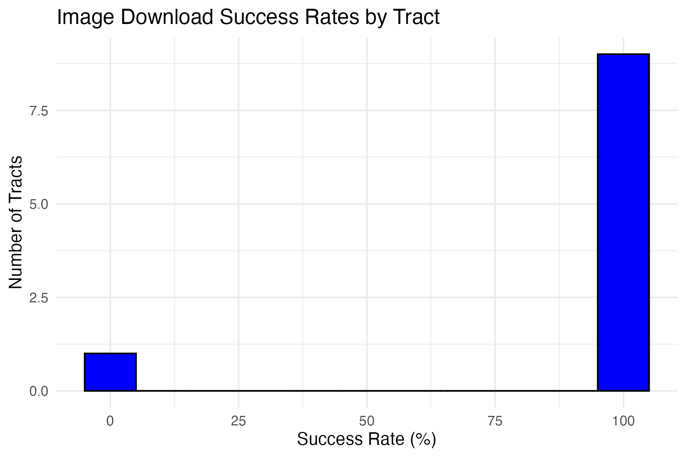
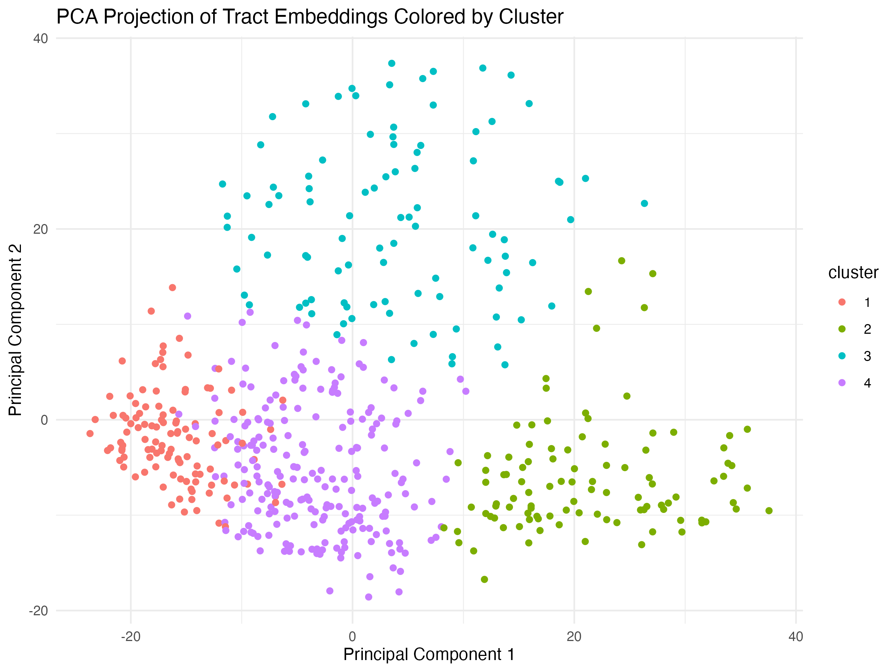
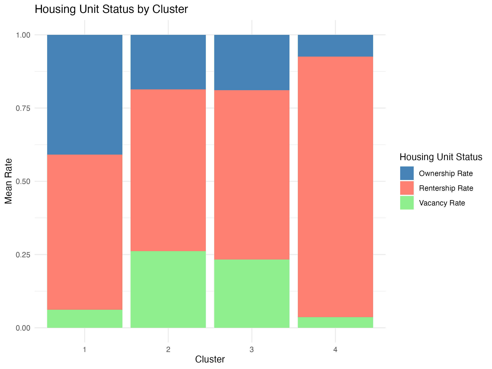
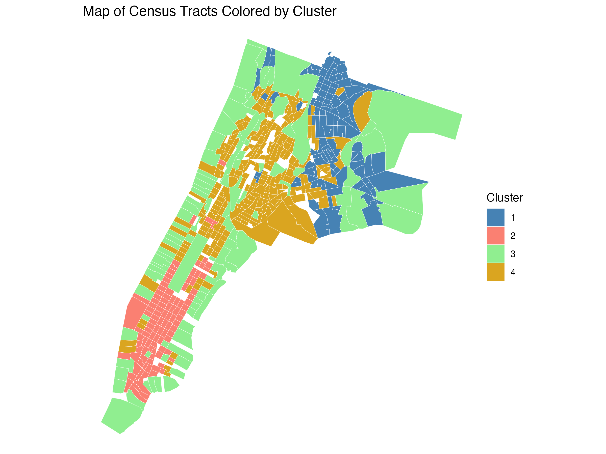
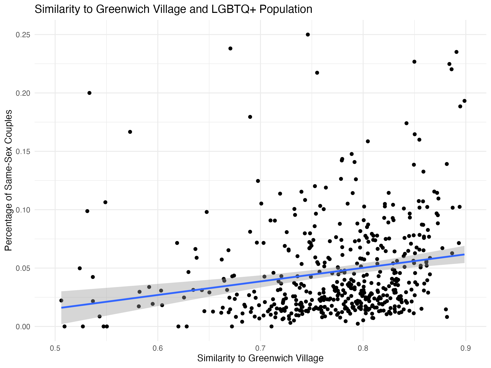
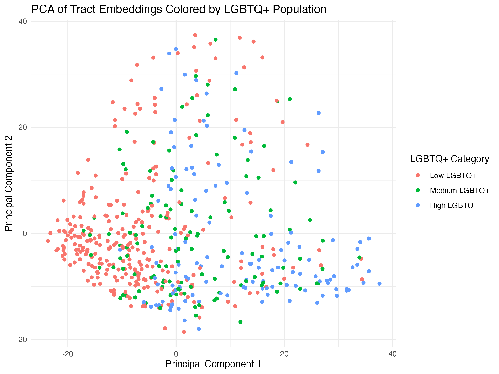

# Research Report

### Sydney Sauer

------------------------------------------------------------------------

### Introduction

Once confined to neighborhoods like Greenwich Village and clandestine bars like the Stonewall Inn, queer spaces have increased dramatically. While full acceptance is yet to come, LGBTQ+ Americans today experience far greater freedom of expression, visibility, and cultural diffusion than two generations ago. My extension project explores whether queer neighborhoods (sometimes called "gayborhoods") retain a distinct visual feel despite the wider spread of queer people and culture.

I tackle this in two interrelated questions. First, how visually distinct from other nearby neighborhoods are historically significant gayborhoods today? Second, are any identifiable visual components of neighborhoods correlated with the density of their queer population? When marginalized groups become more accepted in society, this produces a tension in urban areas between achieving spatial integration and retaining the group's distinctive culture. My extension aims to clarify the balance of these two factors for queer residents of NYC.

### Data and Methods

#### Data Collection

I answer these research questions using image embeddings of randomly sampled Google Street View locations throughout New York and The Bronx. I selected these two subregions of the greater NYC area to get a richer density of sample images within my API resource constraints and to avoid sampling across large geographic discontinuities (i.e., water between Manhattan and Brooklyn) that might introduce noise into the data collection. This yielded 627 Census tracts.

I then used Google Street View to sample between 1 and 30 street-level images per tract, weighted by the tract's land area ntile (n=30). I chose to weight by ntile to get more points for larger areas, which might have greater geographic variation in neighborhood "feel." I back-calculated from a desired sample size of 10,000 images (based on conservative API usage estimates) to set the ntile/maximum number of images per tract to 30. However, this approach had a significant design flaw of pulling an inadequate number of images for the smallest tracts. Additionally, since coordinates were randomly sampled, some locations did not have a Google Street View image available. Two tracts had no successful downloads, but most tracts had a near-perfect image download success rate (Figure 1), leading to an overall success rate of pulling 8,440 total Street View images for 87.2% of randomly sampled coordinates.

**Figure 1.** Google Street View image sampling success rate

{width="611"}

Dropping 91 tracts with less than five images yielded a final analytic sample of 8,219 images across 536 tracts. For each image, I obtained a 1028-dimensional image embedding from Voyage's voyage-multimodal-3.5 model and aggregated them to the tract level by calculating the column means of each embedding dimension. I then L2 normalized each aggregated tract-level embedding to facilitate cosine similarity comparison calculations.

#### Analysis

My first set of analyses explored the visual distribution and similarity of the tracts in four steps. First, I performed PCA and UMAP analysis for a linear and non-linear approach to dimensionality reduction for the tract-aggregated 1028-dimensional embedding vectors. Second, I used k-means clustering to group tracts by similarity and explore variation in the built environment. Third, I created maps to understand the geographic distribution of these results. Fourth, I performed a series of validation checks to ensure face validity.

My second set of analyses exploring the visual similarity of queer neighborhoods is discussed in the "Extension" section.

#### Results

PCA analysis reveals that the first two principal components disproportionately capture variation in the tract-level embeddings, with PC2 explaining close to double the variation of PC3. These results were much clearer than the non-linear UMAP approach, so I limited my analysis to PC1 and PC2 accordingly. Combining this with k-means clustering reveals four substantive neighborhood clusters, three of which are largely distributed among PC1 and one of which (cluster 3) is largely distinguished by PC2 (Figure 2).

**Figure 2.** PCA projection of tract embeddings colored by cluster

{width="563"}

Merging this with tract-level data on housing occupancy from the 2020 Census, I find that variation in home ownership maps onto these four clusters, offering clues as to the distinctions between these principal components (Figure 3). Cluster 1 has high rates of home ownership (40.9%), more than double the home ownership rate in the other clusters. Clusters 2 and 3 are characterized by high rentership and vacancy rates, perhaps signaling neighborhood decline, while Cluster 4 also has a high rentership rate but the lowest vacancy rate (3.6%), perhaps signaling a working-class community.

**Figure 3.** Housing unit status by cluster

{width="509"}

Finally, geographic analysis reveals that most clusters group together spatially (Figure 4). Clusters 1 and 4 are largely located in the Bronx, outside of the city center, while Cluster 2 is largely confined to Manhattan. Interestingly, Cluster 3—which was also the only cluster largely to be distinguished by PC2—is omnipresent, showing no clear spatial pattern.

**Figure 4.** Map of Census tracts colored by cluster

{width="480"}

#### Extension

To extend this pipeline to my research question about the geographic spread of "gayborhood" character, I first calculated the cosine similarity of all tracts to a reference tract of Greenwich Village, a historically queer neighborhood. Surprisingly, I find that many tracts have quite high similarity scores to Greenwich Village (mean = 0.77), suggesting that this tract does not have a unique visual character.

However, additional analyses suggest a modest relationship between visual similarity to Greenwich Village and the percentage of couples in the area who are LGBTQ+ (based on tract-level 2020 Census data). Linear regression reveals a slight positive relationship (Figure 5; correlation=0.20).

**Figure 5.** Similarity to Greenwich Village and LGBTQ+ population

{width="534"}

To reduce my reliance on Greenwich Village data, I broadened my question: Regardless of a specific reference tract, do LGBTQ neighborhoods cluster together visually? PCA analysis reveals some distinction in terms of PC1 and PC2 for low (0-50th percentile) queer population areas (Figure 6). Taken together, these results suggest that while NYC's flagship historically gay neighborhood may have lost some of its distinct character as queer communities have spread and become accepted elsewhere, there remains a small association between this specific "look" and the proportion of queer residents in the area.

**Figure 6.** PCA of tract embeddings colored by LGBTQ+ population

{width="577"}

#### Discussion 

My results suggest that the image embeddings did capture meaningful variation in neighborhood character. Clear geographic groupings of my four k-means clusters was present, and when mapped by principal components, these clusters also showed distinct features. The link to queer neighborhood character is a bit more tenuous. One limitation, however, is the small number of images per tract. My random sampling strategy was also quite naive and could be improved by implementing a more systematic approach, such as stratifying the sampling by zoning areas or block groups within tracts.

Overall, the first principal component seems to capture urbanicity (i.e., commercial areas and multifamily housing) while the second principal component captures the extent of natural space (i.e., parks and waterfronts). In my own manual validation exercises, these dimensions were also quite salient.